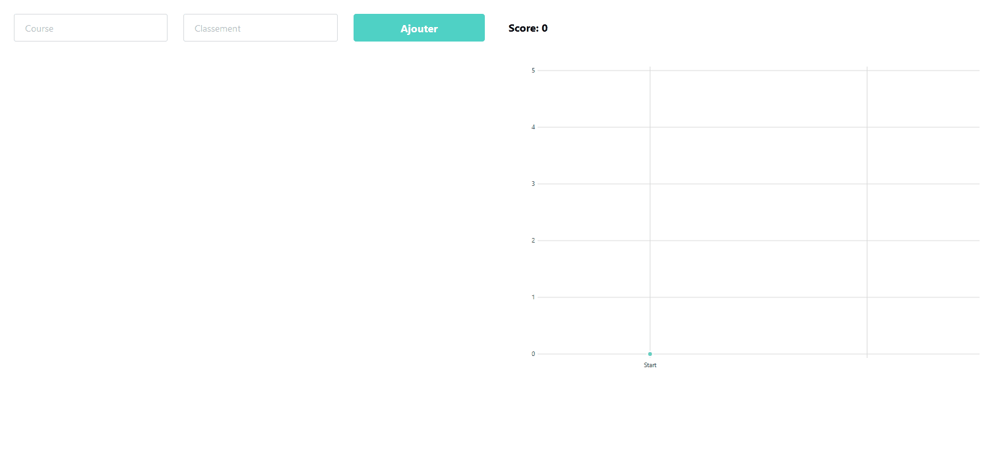

# Svelte Mario Kart (aka Mario Track)

This is a project where I am using/discovering [Svelte](https://svelte.dev). It should be available live [here](https://mario-track-2507f.web.app/).

If not, here is a little GIF where you can see it in action.


The idea is to have a little tool to track your score on Mario Kart game in a "cool" way with a graph. But this is just a test to discover Svelte :P

## Tech

As said, it is made with [Svelte](https://svelte.dev) because it is what I wanted to test/discover it.
I am also using [Tailwind](https://tailwindcss.com/) for some style (and also trying it).
For the graph I am using [Frappe charts](https://frappe.io/charts)

---
## Want to run it ?

Install the dependencies...

```bash
npm install
```

...then start:

```bash
npm run dev
```

Console will indicate you the URL (somewhere on localhost :D). You should see your app running.

## Is project alive

It was just a discovery, so... no really a living project ;)
